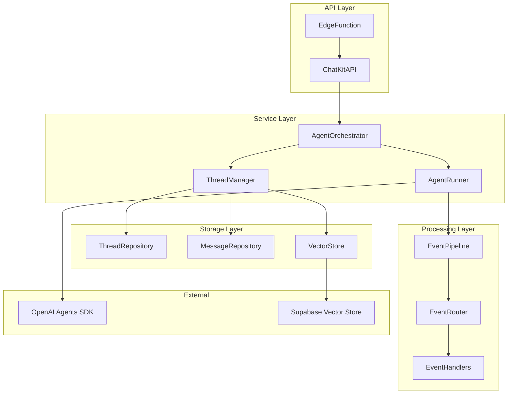

# Agent-Chat Edge Function Analysis

## Overview

The Agent-Chat edge function is a Supabase Edge Function that provides a ChatKit-compatible API for interacting with AI agents. It acts as a bridge between the ChatKit protocol and the OpenAI Agents SDK, handling streaming responses, tool calls, handoffs, and conversation management.

## Architecture Components

### Core Services

1. **ChatKitService** - Main orchestrator that processes ChatKit requests and manages streaming
2. **AgentsService** - Manages agent creation and configuration from database
3. **ThreadsStore** - Handles conversation persistence and vector store integration
4. **StreamProcessor** - Manages event streaming and encoding
5. **MessageProcessor** - Converts between ChatKit and Agent SDK formats

### Event Handlers

- **ModelStreamHandler** - Processes text streaming events
- **ToolCalledHandler** - Handles tool call initiation
- **ToolCallOutputHandler** - Processes tool execution results
- **ToolApprovalHandler** - Manages tool approval workflows
- **HandoffCallHandler** - Handles agent handoffs
- **HandoffOutputHandler** - Processes handoff results

### Factories

- **ItemFactory** - Creates ChatKit-compatible message items
- **WidgetFactory** - Generates UI widgets for tool results and approvals
- **RunnerFactory** - Creates agent runners with multi-provider support

## Sequence Diagram


## ChatKit Events ↔ Agents SDK Events Mapping

### Input Events (Client → Agent)

| ChatKit Event | Agents SDK Event | Handler | Description |
|---------------|------------------|---------|-------------|
| `threads.create` | N/A | ChatKitService | Creates new conversation thread |
| `threads.add_user_message` | N/A | ChatKitService | Adds user message to thread |
| `threads.action` | N/A | ToolHandler | Tool approval/rejection action |
| `threads.custom_action` | N/A | ToolHandler | Custom tool action |
| `threads.get_by_id` | N/A | ChatKitService | Retrieves thread by ID |
| `threads.list` | N/A | ChatKitService | Lists user's threads |
| `items.list` | N/A | ChatKitService | Lists thread items |
| `threads.update` | N/A | ChatKitService | Updates thread metadata |
| `threads.delete` | N/A | ChatKitService | Deletes thread |

### Output Events (Agent → Client)

| ChatKit Event | Agents SDK Event | Handler | Description |
|---------------|------------------|---------|-------------|
| `thread.created` | N/A | ChatKitService | New thread created |
| `thread.updated` | N/A | ChatKitService | Thread metadata updated |
| `thread.item.added` | `run_item_stream_event` | EventHandlers | New message/item added |
| `thread.item.done` | N/A | EventHandlers | Item processing complete |
| `thread.item.updated` | `raw_model_stream_event` | ModelStreamHandler | Content streaming updates |
| `assistant_message.content_part.added` | `output_text_delta` | ModelStreamHandler | Text content part added |
| `assistant_message.content_part.text_delta` | `output_text_delta` | ModelStreamHandler | Text streaming delta |
| `assistant_message.content_part.done` | N/A | ModelStreamHandler | Text content complete |

### Tool-Related Events

| ChatKit Event | Agents SDK Event | Handler | Description |
|---------------|------------------|---------|-------------|
| `thread.item.added` (tool_call) | `run_item_stream_event` (tool_called) | ToolCalledHandler | Tool call initiated |
| `thread.item.added` (tool_result) | `run_item_stream_event` (tool_call_output) | ToolCallOutputHandler | Tool execution result |
| `thread.item.added` (approval_widget) | `run_item_stream_event` (tool_approval_requested) | ToolApprovalHandler | Tool approval required |

### Handoff Events

| ChatKit Event | Agents SDK Event | Handler | Description |
|---------------|------------------|---------|-------------|
| `thread.item.added` (handoff_call) | `run_item_stream_event` (handoff_call_item) | HandoffCallHandler | Agent handoff initiated |
| `thread.item.added` (handoff_result) | `run_item_stream_event` (handoff_output_item) | HandoffOutputHandler | Handoff execution result |

## Current Architecture Issues

### Complexity
1. **Multiple Event Handlers** - 7 different handlers for different event types
2. **Complex State Management** - Streaming state tracked across multiple components
3. **Tight Coupling** - ChatKitService directly manages all handlers and processors
4. **Event Routing Logic** - Complex switch statements for event type routing

### Performance
1. **Sequential Processing** - Events processed one at a time in streaming
2. **Database Calls** - Multiple DB calls per event for persistence
3. **Memory Usage** - Full conversation history loaded for each request

### Maintainability
1. **Large Service Classes** - ChatKitService has 260+ lines
2. **Mixed Responsibilities** - Services handle both business logic and data persistence
3. **Hard to Test** - Tightly coupled components difficult to unit test

## Proposed Simplified Architecture

### Core Principles
1. **Single Responsibility** - Each component has one clear purpose
2. **Event-Driven** - Use event emitters for loose coupling
3. **Pipeline Pattern** - Process events through a configurable pipeline
4. **Dependency Injection** - Inject dependencies for better testability

### New Architecture



### Key Changes

#### 1. AgentOrchestrator (Replaces ChatKitService)
```typescript
class AgentOrchestrator {
  constructor(
    private threadManager: ThreadManager,
    private agentRunner: AgentRunner,
    private eventPipeline: EventPipeline
  ) {}
  
  async processRequest(request: ChatKitRequest): Promise<Response> {
    const thread = await this.threadManager.getOrCreateThread(request);
    const agent = await this.agentRunner.createAgent(request.agentId);
    
    if (request.isStreaming) {
      return this.streamResponse(thread, agent, request);
    } else {
      return this.handleNonStreaming(thread, request);
    }
  }
}
```

#### 2. EventPipeline (Replaces complex event handling)
```typescript
class EventPipeline {
  constructor(private handlers: Map<string, EventHandler[]>) {}
  
  async *process(events: AsyncIterable<AgentEvent>): AsyncIterable<ChatKitEvent> {
    for await (const event of events) {
      const handlers = this.handlers.get(event.type) || [];
      
      for (const handler of handlers) {
        yield* handler.handle(event);
      }
    }
  }
}
```

#### 3. Simplified Event Handlers
```typescript
interface EventHandler {
  canHandle(event: AgentEvent): boolean;
  handle(event: AgentEvent): AsyncIterable<ChatKitEvent>;
}

class TextStreamHandler implements EventHandler {
  canHandle(event: AgentEvent): boolean {
    return event.type === 'output_text_delta';
  }
  
  async *handle(event: AgentEvent): AsyncIterable<ChatKitEvent> {
    // Simplified text streaming logic
  }
}
```

#### 4. Repository Pattern for Data Access
```typescript
interface ThreadRepository {
  create(thread: Thread): Promise<Thread>;
  getById(id: string): Promise<Thread>;
  update(thread: Thread): Promise<void>;
  delete(id: string): Promise<void>;
}

interface MessageRepository {
  add(threadId: string, message: Message): Promise<void>;
  getByThread(threadId: string): Promise<Message[]>;
}
```

### Benefits of Simplified Architecture

1. **Reduced Complexity**
   - Single responsibility per component
   - Clear separation of concerns
   - Easier to understand and maintain

2. **Better Testability**
   - Dependency injection enables mocking
   - Smaller, focused components
   - Clear interfaces for testing

3. **Improved Performance**
   - Parallel event processing
   - Reduced database calls
   - Better memory management

4. **Enhanced Maintainability**
   - Event-driven architecture
   - Pluggable event handlers
   - Clear data flow

5. **Scalability**
   - Easy to add new event types
   - Horizontal scaling of handlers
   - Configurable processing pipelines

### Migration Strategy

1. **Phase 1**: Extract repositories from ThreadsStore
2. **Phase 2**: Create EventPipeline and simplified handlers
3. **Phase 3**: Implement AgentOrchestrator
4. **Phase 4**: Migrate existing functionality
5. **Phase 5**: Remove old components

This simplified architecture maintains all existing functionality while significantly reducing complexity and improving maintainability.